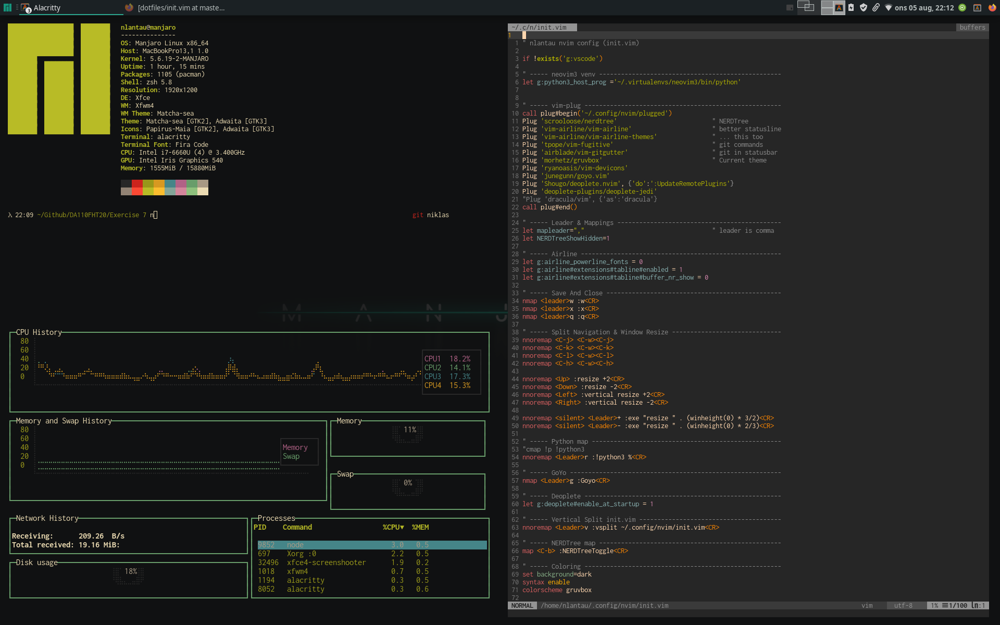

## nlantau's dotfiles

* install.sh
* .zshenv
* .zshrc
* aliasrc
* .fzf
* .vimrc
* nvim/init.vim
* Notes/git_bare
* functions

## Languages
* Vim script
* Shell (zsh/bash/sh)
* Ruby (all generated by Brew)

### Purpose
* Achieve cli awesomeness
* Using vim script and key bindings in VScode
* Speed, speed, speed

### TODO
- [x] UNIX/Linux intercompatibility
- [x] Switch nvim -> vim
- [ ] Complete install.sh
- [ ] Implement on Manjaro 

### Pics

#### MacOS

#### Manjaro

